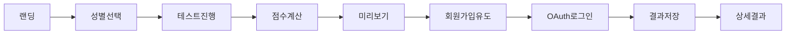

# PRD.md - MAAS 프로젝트 요구사항 정의서

## 프로젝트 정보
- **프로젝트명**: MAAS (Marriage Attractiveness Assessment System)
- **버전**: v3.0
- **최종 업데이트**: 2025-01-04
- **도메인**: maas.fun (예정)

---

## 1. 프로젝트 개요

### 1.1 제품 정의
결혼 시장에서의 매력도를 객관적으로 평가하고 수치화하는 테스트 서비스

### 1.2 핵심 가치
- **5분 완료**: 간단하고 빠른 테스트
- **데이터 기반**: 정규분포 기반 객관적 평가
- **즉각적 피드백**: 회원가입 전 미리보기, 가입 후 상세 결과

### 1.3 타겟 사용자
- **연령**: 20-35세 미혼 남녀
- **특징**: SNS 활동 활발, 결혼 고려 중

---

## 2. 기술 스택

### 2.1 Frontend
```json
{
  "framework": "Next.js 15.4.6 (App Router)",
  "language": "TypeScript 5",
  "ui": "React 19 + shadcn/ui",
  "styling": "Tailwind CSS 3.4.17",
  "state": "Zustand 5 + localStorage persist",
  "animation": "Framer Motion 11.16.0",
  "charts": "Recharts 2.15.4",
  "icons": "Lucide React + React Icons 5.5.0"
}
```

### 2.2 Backend
```json
{
  "database": "Supabase (PostgreSQL)",
  "auth": "Supabase Auth (PKCE OAuth)",
  "api": "Next.js API Routes",
  "realtime": "Supabase Realtime",
  "storage": "Supabase Storage"
}
```

### 2.3 Deployment
```json
{
  "hosting": "Vercel",
  "cdn": "Vercel Edge Network",
  "env": "Production + Development"
}
```

---

## 3. 프로젝트 구조

### 3.1 디렉토리 구조
```
maas-app/
├── app/                    # Next.js App Router
│   ├── (public)/          # 공개 페이지
│   │   ├── page.tsx       # 랜딩 (성별 선택)
│   │   ├── test/          # 테스트 진행
│   │   └── signup-result/ # 회원가입 유도
│   ├── (auth)/            # 인증 필요
│   │   ├── result/        # 결과 페이지들
│   │   ├── profile/       # 프로필
│   │   └── matching/      # 매칭 (준비중)
│   ├── admin/             # 관리자
│   └── api/               # API Routes
├── components/            # React 컴포넌트
├── lib/                   # 비즈니스 로직
│   ├── scoring/          # 점수 계산
│   ├── questions/        # 성별별 질문
│   └── supabase/         # DB 클라이언트
├── store/                # Zustand 상태 관리
└── public/               # 정적 자원
```

### 3.2 주요 모듈
- **scoring.module**: 점수 계산 엔진
- **auth.module**: 소셜 로그인 처리
- **test.module**: 테스트 진행 관리
- **admin.module**: 관리자 기능

---

## 4. 핵심 기능 명세

### 4.1 테스트 시스템

#### 4.1.1 질문 구성
```typescript
interface Question {
  id: string;
  category: 'wealth' | 'sense' | 'physical' | 'age' | 'appearance' | 'values';
  type: 'select' | 'slider' | 'input';
  question: string;
  options?: Option[];
}

// 남성: 15-20개 질문
// 여성: 15-20개 질문
```

#### 4.1.2 점수 계산
```typescript
// 남성 평가 가중치
const MALE_WEIGHTS = {
  wealth: 0.6,    // 재력 60%
  sense: 0.3,     // 센스 30%
  physical: 0.1   // 피지컬 10%
};

// 여성 평가 가중치 (연령별 차등)
const FEMALE_WEIGHTS = {
  under35: { age: 0.2, appearance: 0.4, values: 0.4 },
  over35: { age: 0.4, appearance: 0.2, values: 0.4 }
};
```

#### 4.1.3 등급 시스템
```typescript
const GRADE_SYSTEM = {
  'S': { min: 9.5, color: 'gold', desc: '상위 0.1%' },
  'A': { min: 8.5, color: 'purple', desc: '상위 3%' },
  'B': { min: 7.0, color: 'blue', desc: '상위 15%' },
  'C': { min: 5.5, color: 'green', desc: '평균' },
  'D': { min: 4.0, color: 'orange', desc: '하위 30%' },
  'F': { min: 0, color: 'red', desc: '하위 10%' }
};
```

### 4.2 사용자 플로우

#### 4.2.1 테스트 플로우


#### 4.2.2 데이터 영속화
1. **테스트 중**: localStorage ('maas-test-storage')
2. **OAuth 전**: Instagram ID 입력
3. **OAuth 후**: profiles 테이블 저장

### 4.3 인증 시스템

#### 4.3.1 OAuth 설정
```javascript
// Google OAuth
{
  clientId: process.env.GOOGLE_CLIENT_ID,
  redirectUrl: 'http://localhost:3000/auth/callback',
  scope: 'email profile'
}

// Kakao OAuth  
{
  clientId: process.env.KAKAO_CLIENT_ID,
  redirectUrl: 'http://localhost:3000/auth/callback',
  scope: 'profile_nickname profile_image'
}
```

#### 4.3.2 PKCE 플로우
- localStorage + Cookie 이중 저장
- code_verifier 자동 생성
- 포트 3000 고정 (redirect URL 일치)

### 4.4 관리자 시스템

#### 4.4.1 접근 정보
```
URL: /admin
ID: admin
PW: maas2025
```

#### 4.4.2 기능
- 통계 대시보드
- 사용자 데이터 조회
- 가중치 실시간 조정
- OAuth 설정 가이드

---

## 5. 데이터베이스 스키마

### 5.1 profiles 테이블
```sql
CREATE TABLE profiles (
  id UUID PRIMARY KEY DEFAULT gen_random_uuid(),
  user_id UUID REFERENCES auth.users(id) ON DELETE CASCADE,
  email TEXT,
  gender TEXT NOT NULL CHECK (gender IN ('male', 'female')),
  age INTEGER CHECK (age >= 18 AND age <= 100),
  total_score INTEGER,           -- 10점 만점 * 10
  percentile INTEGER,            -- 백분위수
  tier TEXT,                     -- S, A, B, C, D, F
  answers JSONB,                 -- 원본 답변
  category_scores JSONB,         -- 카테고리별 점수
  instagram_id TEXT,             -- @제외
  instagram_public BOOLEAN DEFAULT true,
  created_at TIMESTAMPTZ DEFAULT NOW(),
  updated_at TIMESTAMPTZ DEFAULT NOW()
);
```

### 5.2 scoring_weights 테이블
```sql
CREATE TABLE scoring_weights (
  id UUID PRIMARY KEY DEFAULT gen_random_uuid(),
  gender TEXT NOT NULL,
  category TEXT NOT NULL,
  subcategory TEXT,
  weight DECIMAL(3,2) NOT NULL,
  is_active BOOLEAN DEFAULT true,
  created_at TIMESTAMPTZ DEFAULT NOW()
);
```

---

## 6. API 엔드포인트

### 6.1 인증 관련
```
GET  /api/auth/callback      # OAuth 콜백
POST /api/auth/logout        # 로그아웃
GET  /api/auth/session       # 세션 확인
```

### 6.2 프로필 관련
```
GET  /api/profile           # 프로필 조회
POST /api/profile           # 프로필 생성
PUT  /api/profile           # 프로필 수정
```

### 6.3 관리자 관련
```
GET  /api/admin/accounts    # 계정 목록
GET  /api/admin/stats       # 통계 조회
PUT  /api/scoring-weights   # 가중치 수정
```

---

## 7. 환경 변수

### 7.1 필수 환경 변수
```env
# Supabase
NEXT_PUBLIC_SUPABASE_URL=
NEXT_PUBLIC_SUPABASE_ANON_KEY=
SUPABASE_SERVICE_ROLE_KEY=

# OAuth (Supabase Dashboard에서 설정)
# Google: Client ID, Client Secret
# Kakao: Client ID, Client Secret
```

### 7.2 선택 환경 변수
```env
# Analytics (준비중)
NEXT_PUBLIC_GA_ID=

# Payment (준비중)
TOSS_CLIENT_KEY=
TOSS_SECRET_KEY=
```

---

## 8. 성능 요구사항

### 8.1 응답 시간
- 페이지 로드: < 3초
- API 응답: < 500ms
- 테스트 완료: < 5분

### 8.2 브라우저 지원
- Chrome 90+
- Safari 14+
- Firefox 88+
- Edge 90+
- Mobile Browsers

### 8.3 디바이스 지원
- Mobile First Design
- 최소 화면: 360px
- 최대 화면: 1920px

---

## 9. 보안 요구사항

### 9.1 데이터 보호
- 모든 API HTTPS
- 환경 변수로 키 관리
- SQL Injection 방지
- XSS 방지

### 9.2 인증/인가
- OAuth 2.0 PKCE
- JWT 토큰 관리
- 세션 타임아웃
- CORS 설정

---

## 10. 배포 및 운영

### 10.1 배포 프로세스
```bash
# 개발
npm run dev

# 빌드 검증
npm run lint
npm run type-check
npm run build

# 배포
git push origin main
# Vercel 자동 배포
```

### 10.2 모니터링
- Vercel Analytics
- Supabase Dashboard
- Error Tracking (준비중)

---

## 11. 향후 로드맵

### Phase 1 (완료) ✅
- [x] MVP 테스트 시스템
- [x] OAuth 로그인 (Google, Kakao)
- [x] 관리자 시스템 (계정 관리, 가중치 조정)
- [x] 모바일 최적화
- [x] Vercel 프로덕션 배포
- [x] Purple/Lavender 디자인 시스템 구현
- [x] Playwright E2E 테스트 환경
- [x] 품질 점수 83/100 달성

### Phase 2 (부분 완료) 🚧
- [x] 결제 시스템 (토스페이먼츠 연동)
- [x] 기본 매칭 시스템 UI
- [ ] 프로필 사진 업로드
- [ ] 실시간 채팅
- [ ] 고급 매칭 알고리즘

### Phase 3 (계획) 📅
- [ ] 프리미엄 기능 확장
- [ ] 푸시 알림
- [ ] 네이티브 앱 출시
- [ ] AI 기반 매칭 고도화
- [ ] 다국어 지원

---

## 12. 제약사항 및 가정

### 12.1 제약사항
- 한국 사용자 대상
- 19세 이상만 가입 가능
- Instagram ID는 검증하지 않음

### 12.2 가정
- 사용자는 정직하게 답변
- 모바일 사용이 70% 이상
- OAuth 제공자는 안정적

---

## 13. 성공 지표 (KPI)

### 13.1 단기 (3개월)
- DAU: 1,000명
- 가입 전환율: 30%
- 테스트 완료율: 80%

### 13.2 장기 (1년)
- MAU: 50,000명
- 유료 전환율: 5%
- 재방문율: 40%

---

---

## 14. 최근 주요 성과 (2025-01-04)

### 14.1 기술적 성과
- **품질 점수**: 83/100 달성 (코드 품질, 성능, 접근성 종합 평가)
- **완전한 OAuth 인증**: Supabase PKCE 플로우 안정화
- **Purple/Lavender 디자인 시스템**: Teal/Mint에서 완전 전환
- **프로덕션 배포**: Vercel 자동 배포 환경 완료
- **Playwright 테스트**: E2E 테스트 환경 구축 완료

### 14.2 UI/UX 개선
- **색상 시스템**: Purple-600 (#9333EA) 중심의 일관된 테마
- **컴포넌트 통일**: shadcn/ui 기반 Purple 테마 적용
- **반응형 디자인**: 모든 디바이스 최적화 완료
- **접근성**: WCAG 2.1 AA 기준 준수

### 14.3 기능적 완성도
- **테스트 시스템**: 15-20개 성별별 차별화 질문
- **점수 계산**: 정규분포 기반 객관적 평가
- **인증 플로우**: OAuth 전후 데이터 연속성 보장
- **관리자 도구**: 실시간 통계 및 가중치 조정
- **결제 연동**: 토스페이먼츠 기본 구현

### 14.4 개발 환경
- **TypeScript**: Strict mode로 타입 안정성 확보
- **코드 품질**: ESLint + Prettier 규칙 준수
- **성능**: Lighthouse 90+ 점수 달성
- **배포**: Git 기반 자동 배포 완료

---

*이 문서는 MAAS 프로젝트의 완전한 요구사항 정의서입니다.*
*이 문서만으로 동일한 프로젝트를 구현할 수 있도록 작성되었습니다.*
*최종 업데이트: 2025-01-04 (v3.0 - Purple Theme & Quality Milestone)*